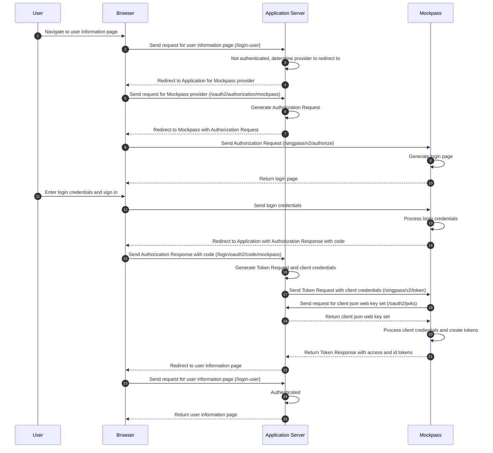

# [WIP] Deno mock-singapore-digital-identity
A mock Singpass/Corppass server for development purposes

## Quick Start

### Configuring the Identity Provider

```
$ export APP_PORT=80
$ export SHOW_LOGIN_PAGE=false
$ export MOCKPASS_NRIC=S8979373D
$ export SERVICE_PROVIDER_MYINFO_SECRET=<your secret here>
$ export ENCRYPT_MYINFO=false
$ export SP_RP_JWKS_ENDPOINT=http://localhost:8080/oauth2/jwks
$ export CP_RP_JWKS_ENDPOINT=http://localhost:8080/oauth2/jwks

$ run -A main.ts
```

### Singpass v2 (NDI OIDC)

Configure your application to point to the following endpoints:

- http://localhost:80/singpass/v2/.well-known/openid-configuration
- http://localhost:80/singpass/v2/.well-known/keys
- http://localhost:80/singpass/v2/authorize
- http://localhost:80/singpass/v2/token

Configure your application (or MockPass) with keys:

- EITHER configure MockPass with your application's JWKS endpoint URL using the env
 var `SP_RP_JWKS_ENDPOINT`.
- OR configure your application to use the private keys from
  `static/certs/oidc-v2-rp-secret.json`.

MockPass accepts any value for `client_id` and `redirect_uri`.

| Configuration item | Explanation |
|---|---|
| Client signing and encryption keys | **Overview:** When client makes any request, what signing key is used to verify the client's signature on the client assertion, and what encryption key is used to encrypt the data payload. <br> **Default:** static keyset `static/certs/oidc-v2-rp-public.json` is used. <br> **How to configure:** Set the env var `SP_RP_JWKS_ENDPOINT` to a JWKS URL that MockPass can connect to. This can be a HTTP or HTTPS URL. |
| Login page | **Overview:** When client makes an authorize request, whether MockPass sends the client to a login page, instead of completing the login silently. <br> **Default:** Disabled for all requests. <br> **How to configure:** Enable for all requests by default by setting the env var `SHOW_LOGIN_PAGE` to `true`. Regardless of the default, you can override on a per-request basis by sending the HTTP request header `X-Show-Login-Page` with the value `true`. <br> **Detailed effect:** When login page is disabled, MockPass will immediately complete login and redirect to the `redirect_uri`. The profile used will be (in order of decreasing precedence) the profile specified in HTTP request headers (`X-Custom-NRIC` and `X-Custom-UUID` must both be specified), the profile with the NRIC specified in the env var `MOCKPASS_NRIC`, or the first profile in MockPass' static data. <br> When login page is enabled, MockPass returns a HTML page with a form that is used to complete the login. The client may select an existing profile, or provide a custom NRIC and UUID on the form. |

### Corppass v2 (Corppass OIDC)

Configure your application to point to the following endpoints:

- http://localhost:80/corppass/v2/.well-known/openid-configuration
- http://localhost:80/corppass/v2/.well-known/keys
- http://localhost:80/corppass/v2/authorize
- http://localhost:80/corppass/v2/token

Configure your application (or MockPass) with keys:

- EITHER configure MockPass with your application's JWKS endpoint URL using the env
 var `CP_RP_JWKS_ENDPOINT`. HTTP/HTTPS endpoints are supported.
- OR configure your application to use the private keys from
  `static/certs/oidc-v2-rp-secret.json`.

MockPass accepts any value for `client_id` and `redirect_uri`.

| Configuration item | Explanation |
|---|---|
| Client signing and encryption keys | **Overview:** When client makes any request, what signing key is used to verify the client's signature on the client assertion, and what encryption key is used to encrypt the data payload. <br> **Default:** static keyset `static/certs/oidc-v2-rp-public.json` is used. <br> **How to configure:** Set the env var `CP_RP_JWKS_ENDPOINT` to a JWKS URL that MockPass can connect to. This can be a HTTP or HTTPS URL. |
| Login page | **Overview:** When client makes an authorize request, whether MockPass sends the client to a login page, instead of completing the login silently. <br> **Default:** Disabled for all requests. <br> **How to configure:** Enable for all requests by default by setting the env var `SHOW_LOGIN_PAGE` to `true`. Regardless of the default, you can override on a per-request basis by sending the HTTP request header `X-Show-Login-Page` with the value `true`. <br> **Detailed effect:** When login page is disabled, MockPass will immediately complete login and redirect to the `redirect_uri`. The profile used will be (in order of decreasing precedence) the profile specified in HTTP request headers (`X-Custom-NRIC`, `X-Custom-UUID`, `X-Custom-UEN` must all be specified), the profile with the NRIC specified in the env var `MOCKPASS_NRIC`, or the first profile in MockPass' static data. <br> When login page is enabled, MockPass returns a HTML page with a form that is used to complete the login. The client may select an existing profile, or provide a custom NRIC, UUID and UEN on the form. |

### MyInfo v3

Configure your application to point to the following endpoints:

- http://localhost:80/myinfo/v3/authorise
- http://localhost:80/myinfo/v3/token
- http://localhost:80/myinfo/v3/person-basic (exclusive to government systems)
- http://localhost:80/myinfo/v3/person

Configure your application (or MockPass) with certificates/keys:

- Provide your application with
  the certificate `static/certs/spcp.crt` as the Myinfo public certificate.
- EITHER configure MockPass with your application's X.509 certificate by setting
  the env vars `SERVICE_PROVIDER_PUB_KEY` and `SERVICE_PROVIDER_CERT_PATH` to 
  the path to the certificate in PEM format. Self-signed or untrusted
  certificates are supported.
- OR configure your application to use the certificate and private key
  from `static/certs/(server.crt|key.pem)`.

MockPass accepts any value for `client_id`, `redirect_uri` and `sp_esvcId`.
The `client_secret` value will be checked if configured, see below.

Only the profiles (NRICs) that have entries in Mockpass' personas dataset will
succeed, using other NRICs will result in an error. See the list of personas in
[static/myinfo/v3.json](static/myinfo/v3.json).

| Configuration item | Explanation |
|---|---|
| Client certificate | **Overview:** When client makes any request, what certificate is used to verify the request signature, and what certificate is used to encrypt the data payload. <br> **Default:** static certificate/key `static/certs/(server.crt\|key.pub)` are used. <br> **How to configure:** Set the env var `SERVICE_PROVIDER_PUB_KEY` to the path to a public key PEM file, and `SERVICE_PROVIDER_CERT_PATH` to the path to a certificate PEM file. (A certificate PEM file can also be provided to `SERVICE_PROVIDER_PUB_KEY`, despite the env var name.) |
| Client secret | **Overview:** When client makes a Token request, whether MockPass verifies the request signature. <br> **Default:** Disabled. <br> **How to configure:** Enable for all requests by setting the env var `SERVICE_PROVIDER_MYINFO_SECRET` to some non-blank string. Provide this value to your application as well. |
| Payload encryption | **Overview:** When client makes a Person or Person-Basic request, whether MockPass encrypts the data payload. When client makes a Person request, whether MockPass verifies the request signature. <br> **Default:** Disabled. <br> **How to configure:** Enable for all requests by setting the env var `ENCRYPT_MYINFO` to `true`. |

To emulate the equivalent of the Test environment on Myinfo v3, you must both
set a client secret and enable payload encryption on MockPass.

### sgID v2

Configure your application to point to the following endpoints:

- http://localhost:5156/v2/.well-known/openid-configuration
- http://localhost:5156/v2/.well-known/jwks.json
- http://localhost:5156/v2/oauth/authorize
- http://localhost:5156/v2/oauth/token
- http://localhost:5156/v2/oauth/userinfo

Configure your application (or MockPass) with certificates/keys:

- Provide your application with the certificate `static/certs/spcp.crt` as the
  sgID public key, or use the signing key published at the JWKS endpoint.
- EITHER configure MockPass with your application's X.509 certificate using the
  env var `SERVICE_PROVIDER_PUB_KEY`, as the path to the certificate in PEM
  format. Self-signed or untrusted certificates are supported.
- OR configure your application to use the certificate and private key
  from `static/certs/(server.crt|key.pem)`.

MockPass accepts any value for `client_id`, `client_secret` and `redirect_uri`.

Only the profiles (NRICs) that have entries in Mockpass' personas dataset will
succeed, using other NRICs will result in an error. See the list of personas in 
[static/myinfo/v3.json](static/myinfo/v3.json).

If the Public Officer Employment Details data item is requested, the 
`pocdex.public_officer_details` scope data is sourced from the
`publicofficerdetails` data key (where present) on personas.
Most personas do not have this data key configured, and will result in a `"NA"`
response instead of an stringified array. As these personas are not identified
in the login page dropdown, please check the personas dataset linked above to
identify them.
The `pocdex.number_of_employments` scope is not supported.

| Configuration item | Explanation |
|---|---|
| Client certificate | **Overview:** When client makes any request, what certificate is used to verify the request signature, and what certificate is used to encrypt the data payload. <br> **Default:** static key `static/certs/key.pub` is used. <br> **How to configure:** Set the env var `SERVICE_PROVIDER_PUB_KEY` to the path to a public key PEM file. (A certificate PEM file can also be provided, despite the env var name.) |
| Login page | **Overview:** When client makes an authorize request, whether MockPass sends the client to a login page, instead of completing the login silently. <br> **Default:** Disabled for all requests. <br> **How to configure:** Enable for all requests by default by setting the env var `SHOW_LOGIN_PAGE` to `true`. Regardless of the default, you can override on a per-request basis by sending the HTTP request header `X-Show-Login-Page` with the value `true`. <br> **Detailed effect:** When login page is disabled, MockPass will immediately complete login and redirect to the `redirect_uri`. The profile used will be (in order of decreasing precedence) the profile with the NRIC specified in the env var `MOCKPASS_NRIC`, or the first profile in MockPass' static data. <br> When login page is enabled, MockPass returns a HTML page with a form that is used to complete the login. The client may select an existing profile, or provide a custom NRIC and UUID on the form. |


## Integration Details

The following things are needed to be configured for the integration:
* Exposing the signature and encryption public keys via a JWKS endpoint
* Use `private_key_jwt` client authentication with the `aud` claim set to the `iss` value and the `typ` header set to `JWT`
* ID token needs to be decrypted with the private decryption key and signature verified against the Identity Provider's JWKS endpoint

### Json Web Key Sets

Mockpass will call the endpoint http://localhost:8080/oauth2/jwks in order to get the public keys of the application
* The public encryption key used for Mockpass to encrypt the ID Token to send to the application
* The public verification key used for Mockpass to verify the signature for the `private_key_jwt` client assertion


## Flow

