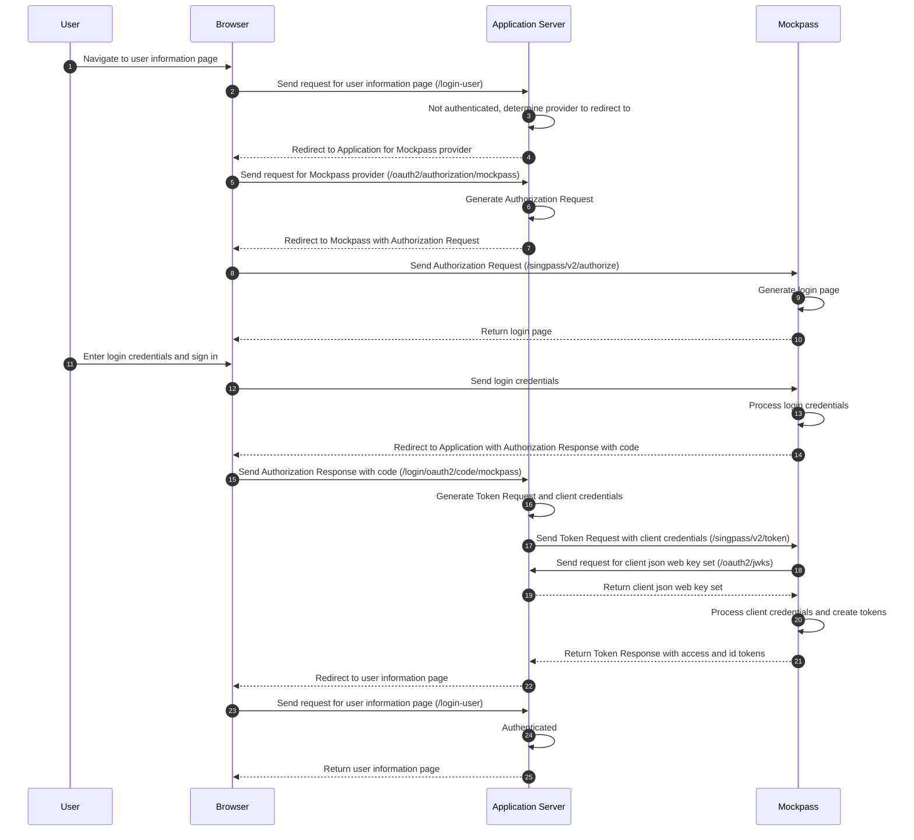

# [WIP] Deno mock-singapore-digital-identity
A mock Singpass/Corppass server for development purposes

## Quick Start

### Configuring the Identity Provider
```
$ export APP_PORT=80
$ export SHOW_LOGIN_PAGE=false
$ export MOCKPASS_NRIC=S8979373D
$ export SERVICE_PROVIDER_MYINFO_SECRET=<your secret here>
$ export ENCRYPT_MYINFO=false
$ export SP_RP_JWKS_ENDPOINT=http://localhost:8080/oauth2/jwks
$ export CP_RP_JWKS_ENDPOINT=http://localhost:8080/oauth2/jwks

$ run -A main.ts
```
### Singpass v2 (NDI OIDC)

### Corppass v2 (Corppass OIDC)

### MyInfo v3

## Integration Details
The following things are needed to be configured for the integration:
* Exposing the signature and encryption public keys via a JWKS endpoint
* Use `private_key_jwt` client authentication with the `aud` claim set to the `iss` value and the `typ` header set to `JWT`
* ID token needs to be decrypted with the private decryption key and signature verified against the Identity Provider's JWKS endpoint

### Json Web Key Sets
Mockpass will call the endpoint http://localhost:8080/oauth2/jwks in order to get the public keys of the application
* The public encryption key used for Mockpass to encrypt the ID Token to send to the application
* The public verification key used for Mockpass to verify the signature for the `private_key_jwt` client assertion

## Flow

