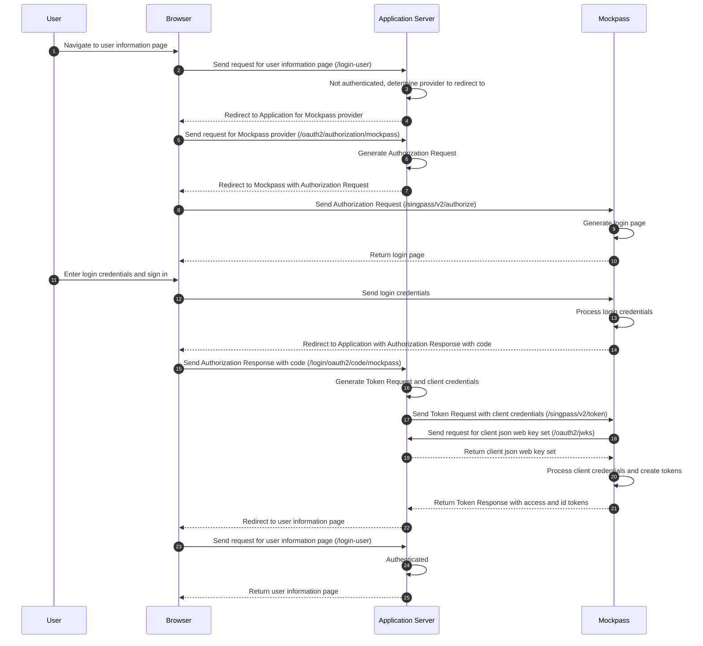

# Deno mock-singapore-digital-identity
A mock Singpass/Corppass server for development purposes

## Quick Start

## Run App
```
$ export APP_PORT=80
$ export SHOW_LOGIN_PAGE=false
$ export MOCKPASS_NRIC=S8979373D
$ export SERVICE_PROVIDER_MYINFO_SECRET=<your secret here>
$ export ENCRYPT_MYINFO=false
$ export SP_RP_JWKS_ENDPOINT=http://localhost:8080/oauth2/jwks
$ export CP_RP_JWKS_ENDPOINT=http://localhost:8080/oauth2/jwks

$ run -A main.ts
```

## Flow

